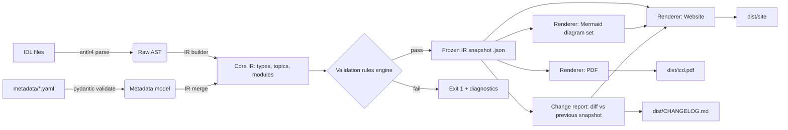
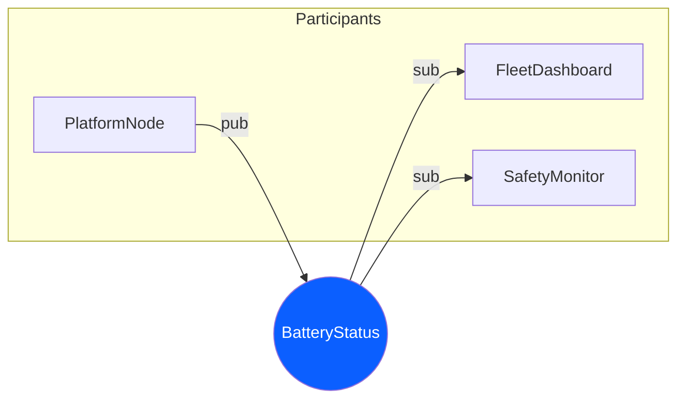
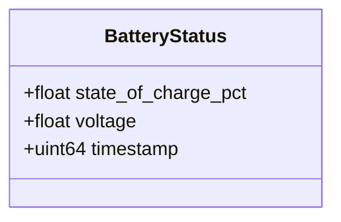
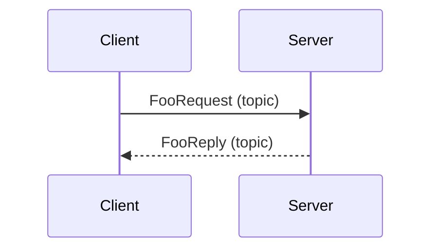

# `idl2icd` — Architecture Design Document

**Status:** Draft v0.1 · **License target:** Apache-2.0 · **Audience:** contributors & implementers

## 0. Guiding principles

1. **IDL is the single source of truth for structure.** Types, topics, modules, and (with the XTypes annex) some
   extended semantics all come from parsing OMG IDL 4.2 — never hand-duplicated.
2. **Metadata is data, not code.** Anything IDL cannot express (QoS profiles, publisher/subscriber bindings, units,
   timing budgets, ownership, criticality, rationale text) lives in structured YAML that is *merged onto* the IDL
   model, never forked from it.
3. **One internal model, many outputs.** Parsing + merging produce a single versioned Intermediate Representation
   (IR). The website, the PDF, the Mermaid diagrams, and the change report are all pure functions of that IR — no
   output format re-derives anything from source files directly.
4. **Deterministic and diffable.** Same inputs → byte-identical output (modulo timestamp exclusions). This is what
   makes the change-report feature and CI "docs drift" checks possible.
5. **Fail loudly, fail early.** A dangling publisher reference to a topic that doesn't exist, or a QoS profile that
   violates a documented compatibility rule, is a build error, not a wiki footnote.
6. **Everything is a plugin except the core loop.** Parsing, validation rules, renderers, and diagram generators are
   all swappable/extensible via a documented interface — the core only orchestrates.

---

## 1. Recommendations (parser + language)

**Implementation language: Python 3.11+.**
Rationale: the target audience (systems/DDS engineers) already has Python tooling in their CI; the templating,
schema-validation, static-site, and PDF ecosystems are mature (Jinja2, Pydantic, WeasyPrint); packaging as a pip-
installable CLI with entry-point plugins is a solved, low-friction problem; and it keeps the contribution bar low
compared to Rust/C++. Performance is not a concern — this is a batch, developer-time tool, not a runtime component.

**IDL parsing: generate a parser from a community-maintained ANTLR4 grammar, don't hand-roll and don't bind a heavy
C++ front-end.**

| Option | Verdict |
| --- | --- |
| Hand-written recursive-descent parser | Rejected as primary — OMG IDL 4.2 grammar (modules, forward decls, `@annotation` syntax, unions with defaults, bounded strings/sequences, bitmask/bitset, bounded arrays of arrays…) is large enough that a hand parser becomes its own multi-year maintenance burden. |
| Bind RIDL / TAO / Fast-DDS-Gen's front-end (C++, via subprocess or bindings) | Rejected as primary — forces every contributor and CI runner to install a full C++ IDL toolchain just to build docs; also these front-ends are optimized to emit code-gen ASTs, not documentation-friendly trees (comments, `@annotation` metadata, and source spans are often discarded). |
| **ANTLR4 grammar (`grammars-v4/idl`) → generated Python parser** | **Recommended.** Grammar-based means correctness tracks the OMG spec instead of your regex intuition; ANTLR gives you a real parse tree with token positions (needed for "click to see source line" and precise error messages); it's a pure-Python runtime dependency (`antlr4-python3-runtime`), no C++ toolchain required by consumers. You maintain a `.g4` file, not a parser. |

Practical detail: OMG IDL doc-comments aren't part of the grammar. We recover them by a **pre-pass token-stream scan**
that associates `//!` / `/** ... */` blocks with the following declaration by line adjacency, attached to the AST as
`doc_comment` before the visitor builds the IR. This is the same technique Doxygen/rustdoc use.

---

## 2. High-level pipeline



The **frozen IR snapshot** (`ir.json`, schema-versioned) is the pivot artifact: it's committed to
`docs/.idl2icd/snapshots/<version>.json` on release, which is what the change-report diffing reads back for "what
changed since last release" without needing the old IDL checked out.

---

## 3. Repository layout

```
idl2icd/
├── pyproject.toml
├── README.md
├── LICENSE
├── src/
│   └── dds_icd/
│       ├── __init__.py
│       ├── cli.py                  # Typer app, entry point `idl2icd`
│       ├── config.py                # ProjectConfig pydantic model + loader
│       ├── grammar/
│       │   └── IDL.g4               # ANTLR4 grammar (vendored, tracked upstream)
│       │   └── generated/           # antlr4 -Dlanguage=Python3 output (generated, gitignored)
│       ├── parsing/
│       │   ├── doc_comments.py
│       │   ├── idl_visitor.py       # ANTLR visitor -> raw AST dataclasses
│       │   └── preprocessor.py      # #include / #ifdef handling (cpp-like, minimal)
│       ├── model/
│       │   ├── ir.py                # Pydantic IR: Module, Struct, Union, Enum, Topic, Field...
│       │   ├── metadata_schema.py   # Pydantic models for metadata YAML
│       │   └── merge.py             # IDL AST + metadata -> IR
│       ├── validation/
│       │   ├── engine.py            # rule runner, severity levels, SARIF-ish output
│       │   └── rules/               # one rule per file, auto-discovered
│       │       ├── r001_dangling_topic_ref.py
│       │       ├── r002_qos_offered_requested_compat.py
│       │       ├── ...
│       ├── diagrams/
│       │   ├── pubsub_graph.py       # Mermaid flowchart of publishers/subscribers/topics
│       │   ├── sequence.py           # Mermaid sequence diagrams (request/reply patterns)
│       │   ├── type_diagram.py       # Mermaid classDiagram for struct/union composition
│       │   └── qos_compat_matrix.py  # rendered as a table + heatmap
│       ├── render/
│       │   ├── site/                # website renderer (Jinja2 + static assets)
│       │   ├── pdf/                 # PDF renderer (HTML->PDF via WeasyPrint)
│       │   └── changereport/
│       ├── plugins/
│       │   ├── spec.py               # pluggy hookspecs
│       │   └── loader.py             # entry_point discovery
│       └── snapshot.py               # IR (de)serialization, diffing
├── themes/
│   └── default/
│       ├── templates/*.html.j2
│       ├── static/{css,js,img}
│       └── theme.yaml
├── schemas/
│   ├── metadata.schema.json          # generated from pydantic, published for editor autocompletion
│   └── project-config.schema.json
├── examples/
│   └── robot-fleet/                  # a runnable example project used in docs + integration tests
│       ├── idl/*.idl
│       ├── metadata/*.yaml
│       └── idl2icd.yaml
├── tests/
│   ├── unit/
│   ├── golden/                       # input -> expected IR/HTML snapshots
│   └── integration/
└── .github/workflows/
    ├── ci.yml
    ├── release.yml
    └── docs-drift.yml
```

---

## 4. Configuration format — `idl2icd.yaml`

Project-root config; everything else (metadata files, themes, rule severities) is referenced from here so the tool
is a single `idl2icd build` away from reproducible output.

```yaml
# idl2icd.yaml
project:
  name: "Robot Fleet Interface Control Document"
  version: "3.2.0"          # ICD version — independent from IDL/software version
  organization: "Comp Robotics"

sources:
  idl:
    - "idl/**/*.idl"
  metadata:
    - "metadata/**/*.yaml"
  include_paths:
    - "idl/"

output:
  site_dir: "dist/site"
  pdf_path: "dist/icd.pdf"
  snapshot_dir: ".idl2icd/snapshots"

theme:
  name: "default"          # or a path to a custom theme dir
  overrides:
    primary_color: "#0B5FFF"
    logo: "assets/logo.svg"

validation:
  rules:
    dangling-topic-ref: error
    qos-compatibility: error
    missing-units: warn
    missing-owner: warn
    undocumented-field: info
  fail_on: warn            # build fails at this severity or above

diagrams:
  pubsub_graph: true
  type_diagrams: true
  sequence_diagrams: true
  qos_matrix: true
  direction: LR            # mermaid flowchart direction

change_report:
  compare_against: "last-tag"   # or a specific snapshot file / git ref
  breaking_change_rules:
    - "field-type-changed"
    - "field-removed"
    - "qos-durability-weakened"

plugins:
  enabled:
    - "dds_icd_confluence_exporter"
    - "dds_icd_ros2_bridge"
```

---

## 5. Metadata schema

Metadata is authored per-topic (or per-module) and merged onto IR nodes by **fully-qualified IDL name**
(`Module::SubModule::TypeName`), so metadata files can live independently from IDL files and be owned by a
different team (systems engineering vs. software).

```yaml
# metadata/telemetry.yaml
topics:
  Robot::Telemetry::BatteryStatus:
    description: >
      Periodic battery state broadcast by every mobile platform. Used by the
      fleet dashboard and the low-power safety monitor.
    criticality: high
    rate:
      nominal_hz: 5
      max_hz: 10
    qos:
      profile: "reliable_transient_local"     # ref into qos_profiles.yaml
      overrides:
        history:
          kind: KEEP_LAST
          depth: 10
    publishers:
      - participant: "PlatformNode"
        instance_count: "1 per robot"
        source: "battery_monitor_service"
    subscribers:
      - participant: "FleetDashboard"
      - participant: "SafetyMonitor"
        notes: "Triggers emergency stop below 8% SOC"
    fields:
      state_of_charge_pct:
        unit: "percent"
        range: [0, 100]
        description: "Coulomb-counted SOC, calibrated at full-charge events."
      voltage:
        unit: "V"
        precision: 0.01
      timestamp:
        unit: "ns since epoch (TAI)"
```

```yaml
# metadata/qos_profiles.yaml  (reusable, referenced by `qos.profile`)
qos_profiles:
  reliable_transient_local:
    reliability: RELIABLE
    durability: TRANSIENT_LOCAL
    history: { kind: KEEP_LAST, depth: 1 }
    deadline: { period_ms: 500 }
    liveliness: { kind: AUTOMATIC, lease_duration_ms: 2000 }
```

Metadata models are Pydantic (`model/metadata_schema.py`), so:

- A JSON Schema is generated on every release (`schemas/metadata.schema.json`) for editor autocompletion (VS Code
  YAML extension, etc.) — this is a deliberate DX investment.
- Unknown keys are rejected (`extra="forbid"`) so typos fail the build instead of silently vanishing.

---

## 6. The parser & IR

### 6.1 Parsing pipeline

1. **Preprocess** — resolve `#include`, strip comments *except* doc-comments (captured separately), handle basic
   `#ifdef`/`#define` (most DDS IDL uses these sparingly; we support a pragmatic subset, not full CPP).
2. **ANTLR parse** → parse tree.
3. **Doc-comment association** — token-stream scan attaches leading comment blocks to the next declaration node.
4. **AST visitor** — walks the parse tree into typed dataclasses (`RawModule`, `RawStruct`, `RawUnion`, `RawEnum`,
   `RawTypedef`, `RawConst`, `@annotation` captures like `@key`, `@topic`, `@optional`, `@default`, `@range`).
5. **Symbol resolution** — build a scoped symbol table to resolve typedefs, nested modules, and `@topic`-annotated
   structs into `Topic` IR nodes (a struct is a "topic type" if annotated `@topic` **or** referenced by a
   metadata file's `topics:` key — metadata can promote a plain struct to topic status for vendors whose IDL doesn't
   use the `@topic` annotation).
6. **Merge metadata** — for each IR node, look up metadata by FQN; unknown metadata targets (typo'd FQN) become a
   validation error, not silent no-op.

### 6.2 Core IR (abbreviated)

```python
class Field(BaseModel):
    name: str
    type_ref: TypeRef            # resolved, not a raw string
    is_key: bool = False
    optional: bool = False
    unit: str | None = None
    range: tuple[float, float] | None = None
    description: str | None = None
    source_span: SourceSpan       # file, line — for "view source" links

class StructType(BaseModel):
    fqn: str
    fields: list[Field]
    doc: str | None
    source_span: SourceSpan

class Topic(BaseModel):
    fqn: str
    data_type: TypeRef
    description: str | None
    criticality: Literal["low","medium","high","safety"] | None
    rate: RateSpec | None
    qos: ResolvedQoS
    publishers: list[Endpoint]
    subscribers: list[Endpoint]

class IRModel(BaseModel):
    schema_version: str = "1.0"
    project: ProjectMeta
    modules: dict[str, Module]
    topics: dict[str, Topic]
    types: dict[str, StructType | UnionType | EnumType]
```

The IR is the **only** thing renderers, diagram generators, and the change-report engine touch. This is what makes
"generate a PDF" and "generate a website" trivially consistent with each other.

---

## 7. Validation rules engine

Rules are small, independently-discoverable units (`validation/rules/*.py`), each declaring:

```python
@register_rule(id="qos-compatibility", default_severity="error")
def check_qos_compatibility(ir: IRModel) -> Iterator[Diagnostic]:
    """RxO compatibility: a subscriber's requested QoS must be <= offered QoS
    (DDS 'RxO' rule) for RELIABILITY and DURABILITY."""
    for topic in ir.topics.values():
        for sub in topic.subscribers:
            if not is_rxo_compatible(topic.qos, sub.requested_qos or topic.qos):
                yield Diagnostic(
                    rule="qos-compatibility", severity="error",
                    message=f"Subscriber {sub.participant} on {topic.fqn} "
                            f"requests incompatible QoS (RxO violation)",
                    location=topic.source_span,
                )
```

Representative built-in rules:

| Rule ID | Checks |
| --- | --- |
| `dangling-topic-ref` | metadata references a topic/type FQN not found in parsed IDL |
| `qos-compatibility` | RxO compatibility between publisher-offered and subscriber-requested QoS |
| `qos-durability-weakened` (also a *breaking-change* rule) | durability lowered vs. previous snapshot |
| `missing-units` | numeric field with no `unit` in metadata (warn) |
| `missing-owner` | topic with no publisher declared |
| `undocumented-field` / `undocumented-topic` | no `description` present |
| `key-field-mismatch` | `@key` fields in IDL not reflected/contradicted in metadata |
| `deadline-vs-rate` | declared `rate.max_hz` incompatible with QoS `deadline.period_ms` |
| `unbounded-sequence-warning` | unbounded sequence/string in a `@topic` type (perf/safety flag) |
| `naming-convention` | topic/type naming pattern enforcement (configurable regex) |

Diagnostics carry `rule`, `severity`, `message`, `location` (file:line via `source_span`), and render as:

- Human-readable console output (via `rich`), grouped by severity, with source snippets.
- A SARIF file (`dist/validation.sarif`) for GitHub code-scanning annotations on PRs.
- Inline badges on the generated website's topic pages ("⚠ 2 warnings on this topic").

`validation.fail_on` in config sets the CI exit-code threshold independent of what's *displayed* (so you can show
info-level notices without failing merges).

---

## 8. Plugin system

Built on **pluggy** (the same library powering pytest's plugin system — proven, small, well-documented).

```python
# plugins/spec.py
class DDSICDHookSpec:
    @hookspec
    def register_validation_rules(self) -> list[Rule]: ...

    @hookspec
    def register_renderers(self) -> list[Renderer]: ...

    @hookspec
    def register_diagram_generators(self) -> list[DiagramGenerator]: ...

    @hookspec
    def on_ir_built(self, ir: IRModel) -> IRModel | None:
        """Allowed to enrich/transform the IR before validation (e.g. pull
        live rate stats from a monitoring system and annotate topics)."""

    @hookspec
    def on_before_render(self, ir: IRModel, ctx: RenderContext): ...

    @hookspec
    def on_after_build(self, artifacts: BuildArtifacts): ...
```

Plugins are discovered via standard Python **entry points** declared in a third-party package's `pyproject.toml`:

```toml
[project.entry-points."dds_icd.plugins"]
confluence_exporter = "dds_icd_confluence_exporter.plugin:ConfluencePlugin"
```

Concrete extensibility examples this unlocks, without touching core:

- **Exporters**: publish the rendered site to Confluence/SharePoint; export IR as OpenAPI-like JSON for tooling.
- **Extra diagram types**: a deployment-topology diagram plugin drawing physical-node → participant mapping.
- **Extra parsers**: a plugin that ingests `.msg`/ROS2 IDL variants or XTypes-annotated IDL with vendor pragmas.
- **Live enrichment**: a plugin that queries a running DDS domain (via `rti-connext` Python API or `cyclonedds`
  bindings) at build time to annotate observed rates vs. documented `rate.nominal_hz`, flagging drift.
- **Custom validation packs**: a company can ship an internal `acme_dds_rules` plugin enforcing org-specific
  QoS policy without forking the tool.

---

## 9. CLI design

Built with **Typer** (Click under the hood — good `--help`, shell completion, testability via `CliRunner`).

```
idl2icd init [DIR]                     # scaffold a new project (idl2icd.yaml, example idl/, metadata/)
idl2icd validate [--config FILE]       # parse + merge + run validation only, no rendering; CI-friendly, fast
idl2icd build [--config FILE]          # full pipeline: parse -> validate -> render site + pdf + diagrams
idl2icd build --format site|pdf|diagrams|all
idl2icd diff [--against REF]           # change report vs. a git ref or a stored snapshot, printed or as markdown
idl2icd snapshot save [--tag v3.2.0]   # freeze current IR to .idl2icd/snapshots/
idl2icd serve [--port 8080]            # local dev server with live-reload on IDL/metadata edits
idl2icd doctor                          # environment check: ANTLR runtime, wkhtmltopdf/weasyprint deps, plugin list
idl2icd plugins list
```

Every subcommand supports `--output-format text|json` for scripting, and non-zero exit codes are reserved strictly
for validation failures/parse errors (never for "warnings displayed"), so CI steps can branch cleanly.

---

## 10. Templates & website renderer

- **Templating:** Jinja2, rendering IR → static HTML. No client-side framework needed for content; a small amount of
  vanilla JS for search-as-you-type (using a prebuilt Lunr.js/FlexSearch index generated at build time) and for
  collapsible type trees.
- **Theme contract:** a theme is a directory with `templates/*.html.j2`, `static/`, and `theme.yaml` declaring
  color tokens and which template overrides it provides; the renderer falls back to `themes/default` for anything
  not overridden, so a custom theme can override just `topic.html.j2` and inherit everything else.
- **Pages generated per IR:**
  - Landing page: project metadata, version, module tree, search.
  - Per-topic page: description, QoS table, publishers/subscribers, field table with units/ranges, the Mermaid
    pub/sub graph centered on that topic, "view IDL source" panel, validation badges, link to change history.
  - Per-type page: struct/union/enum layout, used-by (topics/other types), Mermaid composition diagram.
  - QoS profile pages: full profile definitions + compatibility matrix.
  - Change log page: rendered from the change-report engine (see §12).
  - Global pub/sub graph page.
- **Static, hostable anywhere:** output is plain HTML/CSS/JS — deployable to GitHub Pages with zero server
  component, which is the default CI target (see §14).

### PDF rendering

Rather than a second templating pass, PDF reuses the *same* Jinja2 HTML templates with a `pdf` render mode
(print-oriented CSS, page-break rules, running headers/footers with page numbers) and converts via **WeasyPrint**
(pure-Python, good CSS-print support, no headless-browser dependency — much lighter CI footprint than
Playwright/Chromium for this use case, since it's document HTML, not interactive JS). Mermaid diagrams destined for
PDF are pre-rendered to SVG at build time (via `mermaid-cli`/`mmdc` in a build-only Node step) since WeasyPrint
doesn't execute JS.

---

## 11. Mermaid diagram generation

All diagrams are generated as **Mermaid source** embedded in the HTML (rendered client-side via mermaid.js on the
website — supports pan/zoom/click-through) and **pre-rendered to SVG** for the PDF path.

**a) Pub/sub topology** (`flowchart`):



**b) Type composition** (`classDiagram`), generated from struct/union field types:



**c) Request/reply sequence** (`sequenceDiagram`), generated when metadata marks a topic pair as a request/reply
pattern (common DDS-RPC convention: `FooRequest` / `FooReply` topics linked via a `rpc:` metadata block):



**d) QoS compatibility matrix** — not Mermaid (tables render better as HTML), but generated the same way: a
pairwise pub×sub grid colored green/red by RxO compatibility, computed by the same rule engine that produces the
`qos-compatibility` validation diagnostics — one source of truth for "is this compatible," surfaced twice.

Diagram generation is itself a plugin hook (`register_diagram_generators`) — the four above are the built-ins,
shipped as the "core" plugin registered by default.

---

## 12. Change reports

Two comparison modes, both operating on **IR snapshots**, never on raw file diffs (so renames, reordering, and
comment-only changes don't produce noise):

1. **Snapshot-to-snapshot** (`idl2icd diff --against v3.1.0`): compares the current IR against a previously frozen
   `.idl2icd/snapshots/v3.1.0.json`.
2. **Working-tree-to-last-tag** (default in CI on PRs): builds IR from the PR branch, compares against the IR
   rebuilt from the base branch/tag.

Diff algorithm operates per-entity (topics, types, fields, QoS profiles) keyed by FQN, classifying each change as:

| Class | Examples |
| --- | --- |
| **Breaking** | field removed, field type changed incompatibly, key field changed, durability/reliability weakened, topic removed |
| **Additive / compatible** | new optional field, new topic, new subscriber added, documentation-only edit |
| **Informational** | description/units edited, rate changed, criticality changed |

Output: a Markdown change report (also the source for the website's Change Log page) —

```markdown
## v3.2.0 — 2026-07-29

### ⚠ Breaking changes
- `Robot::Telemetry::BatteryStatus.voltage`: type changed `float` → `double`
- `Robot::Telemetry::PowerAlert`: topic removed (subscribers: SafetyMonitor)

### ✅ Additive changes
- `Robot::Telemetry::BatteryStatus`: new optional field `temperature_c`
- New topic `Robot::Telemetry::ChargeCycleCount`

### ℹ️ Informational
- `BatteryStatus.state_of_charge_pct`: description updated
```

The **breaking-change classification rules are themselves entries in the validation rule registry** (§7), so a CI
policy can say "breaking changes fail the build unless `project.version` has a major bump" — enforced identically
to any other validation rule, reusing the same Diagnostic/SARIF plumbing.

---

## 13. Testing strategy

| Layer | Approach |
| --- | --- |
| **Grammar/parser** | Golden-file tests: a corpus of `.idl` fixtures (including edge cases — nested modules, forward decls, unions with implicit default, `@annotation` variants, bounded types) parsed and compared against expected AST/IR JSON. Any grammar regression breaks a specific fixture, not a vague integration test. |
| **Metadata merge** | Property-based tests (Hypothesis) generating random valid/invalid metadata trees to fuzz the merge + validation logic for crashes and confirm every invalid case produces a Diagnostic, not a stack trace. |
| **Validation rules** | Unit test per rule: one fixture IR that should pass, one that should fail, asserting exact Diagnostic fields. |
| **Renderers** | Snapshot testing: render the `examples/robot-fleet` project, diff generated HTML/PDF-text-content against committed golden output; PDF compared via extracted text (WeasyPrint output isn't byte-stable across font versions, so compare structure/content, not raw bytes). |
| **Diagrams** | Mermaid *source* string snapshot tests (deterministic, no rendering needed) plus a smoke test that `mmdc` can actually render the generated source without syntax errors. |
| **CLI** | Typer's `CliRunner` for every subcommand, including exit-code assertions for the validate/build failure paths. |
| **Plugin system** | A minimal example plugin package in `tests/fixtures/example_plugin/` verifying each hookspec fires and can mutate/extend output. |
| **End-to-end** | The `examples/robot-fleet` project is built in CI on every PR as a real integration smoke test, and its generated site is diffed for unexpected changes (docs-drift gate — see §14). |
| **Regression corpus** | Any bug report that reveals a parser/validation gap gets its fixture added permanently to the golden corpus — the project's own change history becomes the test suite's growth engine. |

Target: parser + IR + validation logic at >90% branch coverage (the parts that are silent-failure-dangerous);
renderers held to snapshot-diff coverage rather than raw % since HTML branch coverage is a poor signal.

---

## 14. CI/CD (GitHub Actions)

**`ci.yml`** — on every push/PR:

```yaml
name: CI
on: [push, pull_request]
jobs:
  test:
    runs-on: ubuntu-latest
    strategy:
      matrix:
        python-version: ["3.11", "3.12", "3.13"]
    steps:
      - uses: actions/checkout@v4
      - uses: actions/setup-python@v5
        with: { python-version: "${{ matrix.python-version }}" }
      - run: pip install -e ".[dev]"
      - run: pytest --cov=dds_icd --cov-report=xml
      - run: ruff check .
      - run: mypy src/
      - uses: codecov/codecov-action@v4

  build-example:
    runs-on: ubuntu-latest
    needs: test
    steps:
      - uses: actions/checkout@v4
      - uses: actions/setup-python@v5
        with: { python-version: "3.12" }
      - run: pip install -e .
      - run: idl2icd validate --config examples/robot-fleet/idl2icd.yaml
      - run: idl2icd build --config examples/robot-fleet/idl2icd.yaml
      - name: Upload SARIF
        uses: github/codeql-action/upload-sarif@v3
        with: { sarif_file: dist/validation.sarif }
      - uses: actions/upload-artifact@v4
        with: { name: example-site, path: dist/site }
```

**`docs-drift.yml`** — PR-only gate ensuring generated docs are committed/consistent, and surfacing the change
report as a PR comment:

```yaml
name: Docs Drift & Change Report
on: [pull_request]
jobs:
  change-report:
    runs-on: ubuntu-latest
    steps:
      - uses: actions/checkout@v4
        with: { fetch-depth: 0 }
      - uses: actions/setup-python@v5
        with: { python-version: "3.12" }
      - run: pip install -e .
      - run: idl2icd diff --against origin/${{ github.base_ref }} --output-format markdown > diff.md
      - uses: marocchino/sticky-pull-request-comment@v2
        with: { path: diff.md }
      - name: Fail on breaking change without major bump
        run: idl2icd validate --config idl2icd.yaml --rule breaking-change-requires-major-bump
```

**`release.yml`** — on tag push (`v*`):

```yaml
name: Release
on:
  push:
    tags: ["v*"]
jobs:
  release:
    runs-on: ubuntu-latest
    permissions:
      contents: write
      pages: write
      id-token: write
    steps:
      - uses: actions/checkout@v4
      - uses: actions/setup-python@v5
        with: { python-version: "3.12" }
      - run: pip install -e .
      - run: idl2icd snapshot save --tag ${{ github.ref_name }}
      - run: idl2icd build --format all
      - run: git add .idl2icd/snapshots && git commit -m "chore: snapshot ${{ github.ref_name }}" && git push
      - uses: actions/upload-pages-artifact@v3
        with: { path: dist/site }
      - uses: actions/deploy-pages@v4
      - uses: softprops/action-gh-release@v2
        with: { files: dist/icd.pdf }
```

This gives, out of the box: PR-time validation + SARIF annotations + a posted change-report comment; tag-time
snapshot freezing, website deploy to GitHub Pages, and a PDF attached to the GitHub Release.

---

## 15. Recommended library set (summary)

| Concern | Library | Why |
| --- | --- | --- |
| IDL grammar/parser | `antlr4-python3-runtime` + `grammars-v4/idl` | Correctness via community-maintained grammar, no C++ toolchain needed |
| Config/metadata validation | `pydantic` v2 | Fast, generates JSON Schema for editor autocompletion, great error messages |
| CLI | `typer` (+ `rich` for output) | Ergonomic, testable, good `--help` UX |
| Plugin system | `pluggy` | Proven (pytest), tiny, well-documented hookspec model |
| Templating | `jinja2` | Ubiquitous, fast, good for both HTML and print-CSS output |
| PDF | `weasyprint` | Pure-Python, strong CSS print support, no headless-browser CI overhead |
| Diagrams | `mermaid.js` (client-side) + `@mermaid-js/mermaid-cli` (`mmdc`, build-time SVG for PDF) | Renders identically to what most engineers already use in markdown docs |
| Client-side search | `lunr.js` or `flexsearch`, index built at compile time | No server component, keeps site static |
| Testing | `pytest`, `hypothesis`, `syrupy` (snapshot testing) | Standard, expressive |
| Lint/type-check | `ruff`, `mypy` | Fast, single-tool linting + formatting |
| Packaging | `hatchling` via `pyproject.toml`, entry points for CLI + plugins | Modern, PEP 621-compliant |

---

## 16. Extensibility roadmap (post-v1)

- **XTypes-aware diffing**: use XTypes TypeObject hashes (where vendor toolchains expose them) to cross-check that
  the documented "breaking change" classification matches actual wire-compatibility, not just a syntactic guess.
- **Live domain introspection plugin**: connect to a running DDS domain (via `rticonnextdds-connector` or
  `cyclonedds-python`) to annotate docs with observed vs. documented rates/QoS, flagging drift automatically.
- **Multi-IDL-dialect front-ends**: DDS-RPC IDL annotations, ROS 2-flavored `.idl`, and Zenoh's DDS-compatible
  subset, all normalizing into the same IR via pluggable front-ends.
- **Diagram plugin: deployment topology** — physical node → DomainParticipant → topic mapping for larger fleets.
- **Docs-as-code exporters**: Confluence, SharePoint, and Structurizr/C4-model exporters as separate plugin
  packages, keeping the core dependency-light.

---

*End of architecture draft. Next artifacts to produce on request: the ANTLR grammar skeleton, the Pydantic IR/metadata
models in full, and a working `examples/robot-fleet` scaffold.*
